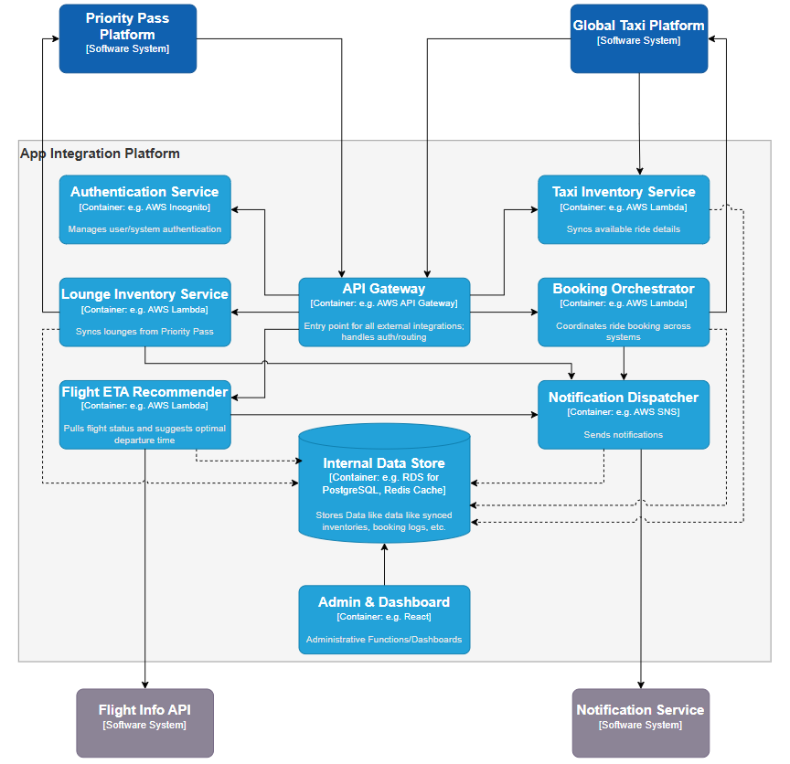

# 🧱 C4 Diagrams – App Integration Platform

This directory contains all architectural diagrams for the **App Integration Platform**, structured according to the [C4 Model](https://c4model.com/):

- **Context Diagram** – High-level system boundaries and external interactions
- **Container Diagram** – Internal services and responsibilities
- **Component Diagram** – Detailed breakdown of key service logic (Booking Orchestrator)

---

## 🔹 1. System Context Diagram

📍 Location: [`/c4-diagrams/context/`](./context/)

**Purpose**: Shows how the App Integration Platform interacts with:
- Travelers using the Priority Pass App
- Travelers using the Global Taxi App
- The Priority Pass backend
- The Global Taxi App backend

🧾 See full explanation in [Context/README.md](./context/README.md)

---

## 🔹 2. Container Diagram

📍 Location: [`/c4-diagrams/container/`](./container/)

**Purpose**: Decomposes the Integration Platform into core services including:
- Booking Orchestrator
- Lounge Inventory
- Taxi Inventory
- Notification Service
- ETA Recommendation

🧾 See full explanation in [Container/README.md](./container/README.md)

---

## 🔹 3. Component Diagram

📍 Location: [`/c4-diagrams/component/`](./component/)

**Purpose**: Shows the internal structure of the **Booking Orchestrator**, including:
- Booking Controller
- Validator
- Workflow Engine
- Taxi API Client
- Repository and Event Publisher

🧾 See full explanation in [Component/README.md](./component/README.md)

---

## 📚 Notes

- All diagrams were generated in drawio and exported as PNG.
- All source `.drawio` files stored in devfiles folder.
- Diagrams are optimized for technical and non-technical presentation, with clear separation of concerns and traceable flows.

---

