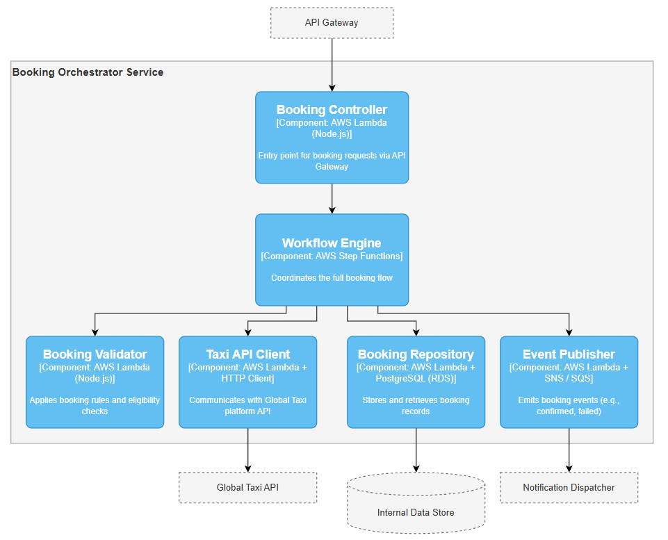

# 📋 Booking Orchestrator Service

The **Booking Orchestrator** is the core component responsible for managing the complete lifecycle of a taxi booking initiated from the Priority Pass App. It validates requests, interacts with the Global Taxi platform, stores booking records, and emits relevant events.

This service is designed for high reliability, fault tolerance, and modular extensibility.

---

## 🔹 Component Diagram

---

## 🔧 Responsibilities

- Accept booking requests via API Gateway
- Validate booking rules (e.g., user eligibility, lounge context)
- Coordinate the full booking process via AWS Step Functions
- Communicate with the Global Taxi backend for booking confirmation
- Persist booking records to the internal data store
- Emit booking lifecycle events to downstream services (e.g., notifications)

---

## 🧩 Internal Components

| **Component Name**         | **Description**                                  | **Technology**                     |
|----------------------------|--------------------------------------------------|------------------------------------|
| **Booking Controller**     | Entry point for booking requests via API Gateway | AWS Lambda (Node.js / Python)      |
| **Booking Validator**      | Applies booking rules and eligibility checks     | AWS Lambda                         |
| **Workflow Engine**        | Coordinates the full booking flow                | AWS Step Functions                 |
| **Taxi API Client**        | Communicates with Global Taxi API                | AWS Lambda + Axios / Requests      |
| **Booking Repository**     | Stores and retrieves booking records             | AWS Lambda + PostgreSQL (RDS)      |
| **Event Publisher**        | Emits booking events (e.g., confirmed, failed)   | AWS Lambda + SNS / SQS             |

---

## 🛠️ Technologies Used

- **AWS Lambda** – Stateless compute for business logic
- **AWS Step Functions** – Serverless workflow engine for orchestration
- **Amazon RDS (PostgreSQL)** – Persistent store for booking data
- **Amazon SNS/SQS** – Event distribution to Notification Service
- **API Gateway** – Public entry point for client requests

---

## 🔗 External Integrations

- **Global Taxi API** – Third-party service for real-time ride booking
- **Internal Data Store** – Shared data store used by all services
- **Notification Dispatcher** – Receives booking events for messaging users

---

## 📈 Observability & Error Handling

- Built-in retries and fallbacks via Step Functions
- CloudWatch logging for all Lambda invocations
- Booking failure paths trigger user-facing error events

---

## ♻️ Extensibility

The orchestrator is designed to support future enhancements like:
- Loyalty program integration
- Booking modifications or cancellations
- Real-time driver tracking (via WebSocket or polling layer)

---

#### 🔗 Previous: [← Container Diagram](../container/README.md)
