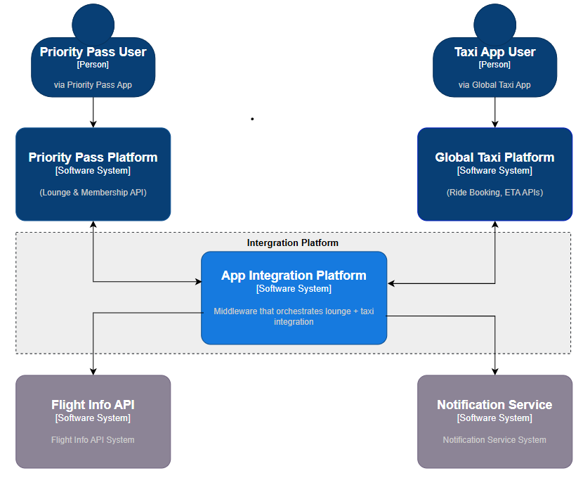

# 🧭 C4 Context Diagram – App Integration Platform

This diagram shows the **high-level system context** for the solution. It illustrates how the App Integration Platform enables seamless communication and data exchange between the **Priority Pass ecosystem** and the **Global Taxi Platform**, enhancing the airport journey for travelers.

---

## 🎯 Objective

To enable users to:
- Book airport transport from within the Priority Pass app
- Receive tailored recommendations based on flight times
- Discover lounge and taxi service options in a unified experience

---

## 🧭 Context

---

## 🧱 Key Systems & Actors

| **Element** | **Description** |
|-------------|-----------------|
| **Traveler** | End user booking taxis or accessing lounges via App |
| **Priority Pass Mobile App** | Client-facing app where bookings and experiences are managed |
| **Global Taxi Mobile App** | Client-facing app where taxi bookings are managed |
| **Priority Pass Backend** | Core system that authenticates users and manages user profiles and entitlements |
| **Global Taxi App Backend** | Third-party ride-hailing platform offering taxi services |
| **App Integration Platform** | Middleware system built for integrating Priority Pass and Global Taxi ecosystems |

---

## 🔄 How It Works

- The **Traveler** interacts with the **Priority Pass Mobile App**, which communicates with its own backend.
- The **Priority Pass Backend** and the **Global Taxi Backend** both interface with the **App Integration Platform**.
- The **App Integration Platform**:
  - Orchestrates bookings
  - Synchronizes lounge and taxi content
  - Provides ETA recommendations
  - Dispatches notifications
- The **Traveler** experiences a seamless journey through a unified front-end, unaware of the underlying integrations.

---

## 🔒 Security Considerations

- All communication between systems is authenticated using JWT or OAuth tokens.
- Sensitive data (bookings, personal info) is encrypted in transit (HTTPS) and at rest.

---

## 📈 Benefits of This Design

- **Loose coupling** between systems
- **Centralized orchestration** logic for cross-platform features
- **Scalability** via containerized or serverless microservices
- Enables **future extensibility** (e.g., hotel booking, shuttle integration, loyalty points)

---

## 🔗 Document Navigation
- Next: [Container Diagram →](../container/README.md)
- Previous: [← C4 Diagrams](../README.md)

